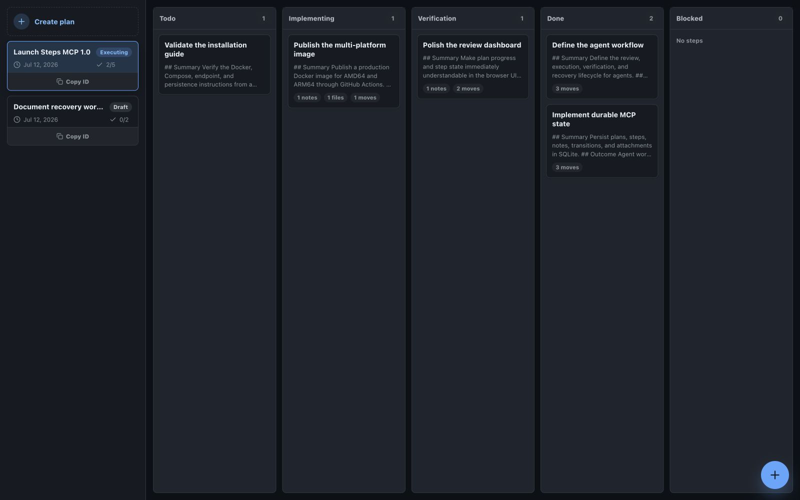
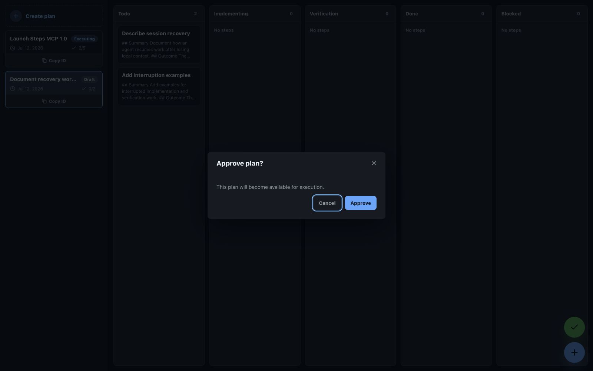
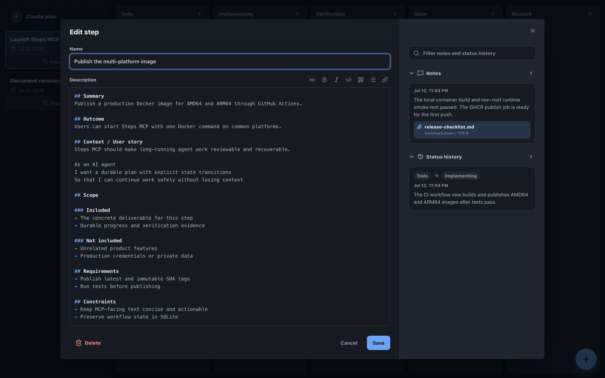

# Steps MCP

Steps MCP is an agent-friendly task planning and execution MCP server with durable SQLite storage and a browser UI for reviewing plans and following progress.



The board makes the execution state visible at a glance while the MCP surface gives agents compact tools, durable resources, and an explicit next safe action.

## Run with Docker

```bash
docker run -d \
  --name steps-mcp \
  --restart unless-stopped \
  -v steps-mcp-data:/app/data \
  -p 3001:3001 \
  ghcr.io/dassader/steps-mcp:latest
```

The `/app/data` volume stores plans, steps, notes, transitions, attachments, and workflow state.

After the container starts:

- MCP endpoint: `http://localhost:3001/mcp`
- User interface: `http://localhost:3001/`
- Health check: `http://localhost:3001/health`

Connect an MCP client to the Streamable HTTP endpoint above. Call `server.get_started` for the built-in workflow guide, then use the returned prompts, tools, and resource URIs to plan and execute work.

## Workflow

Steps MCP keeps planning, review, execution, verification, and blockers explicit:

1. Create a draft plan and detailed steps.
2. Review the plan in the browser UI and record explicit approval.
3. Start the server-selected next step.
4. Add durable notes and attachments while work progresses.
5. Move completed implementation through verification, or record an honest blocker.

Tool responses include the current state, relevant identifiers, and the next safe action so an agent does not need the entire state machine in tool descriptions.



## Durable work evidence

Every status transition creates an audit note. Agents can also add standalone notes and attach text, binary evidence, or links without changing step status.



## Demo and examples

The repository includes a runnable MCP client that creates the workflow shown above:

```bash
npm run build
DB_PATH=./data/demo.db npm start
```

In another terminal:

```bash
npm run demo:seed
```

See [examples](examples/README.md) for the demo setup and representative `plan.create_with_steps`, `plan.approve`, and `step.transition` calls.

## Run with Compose

```bash
docker compose up -d
```

The `latest` image is published for `linux/amd64` and `linux/arm64`, so Docker selects the correct platform automatically.

To expose a different host port:

```bash
STEPS_MCP_PORT=8799 docker compose up -d
```

## Configuration

| Variable | Default | Purpose |
| --- | --- | --- |
| `HOST` | `0.0.0.0` in Docker | HTTP bind address |
| `PORT` | `3001` | Container HTTP port |
| `PUBLIC_URL` | `http://localhost:3001` | Base URL returned in browser review links |
| `MCP_ENDPOINT` | `/mcp` | Streamable HTTP MCP path |
| `MCP_STATEFUL` | `true` | Enables stateful MCP sessions |
| `MCP_JSON_RESPONSE` | `false` | Returns JSON responses instead of opening SSE streams |
| `DB_PATH` | `/app/data/steps.db` in Docker | SQLite database path |
| `ALLOWED_ORIGINS` | empty | Additional comma-separated browser origins |

## Local development

Requires Node.js 20 or newer.

```bash
npm ci
npm run typecheck
npm test
npm run build
npm start
```

The default local database is `steps.db`. Copy `.env.example` to `.env` to customize local settings.

## License

[ISC](LICENSE)
